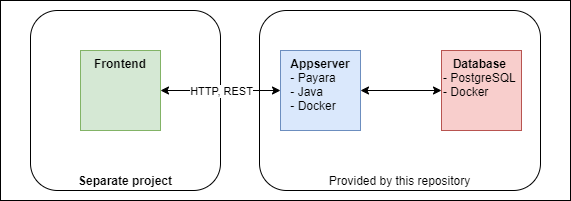

# Simple Java REST Backend <!-- omit in toc -->

This project contains a simple Java REST backend connected to a database that can be used to test your architecture
setup (not production ready!). Docker & Docker-Compose are being used to make the installation easy. This project can be
used as it is to test two-tier-architectures (app + db), but can be extended to a three-tier-architecture by providing a
frontend that is connected to the backend via REST API. A simple frontend to play around is available here:
[Simple React Frontend](https://github.com/MWSandbox/simple-react-frontend)

1. [Tech-Stack](#tech-stack)
2. [Features](#features)
3. [Developer Instructions](#developer-instructions)
   1. [Prerequisites](#prerequisites)
   2. [How to get started](#how-to-get-started)
      1. [Get started locally](#get-started-locally)
      2. [Get started with remote docker registry](#get-started-with-remote-docker-registry)
      3. [Get started with AWS EC2](#get-started-with-aws-ec2)
   3. [Useful commands](#useful-commands)

# Tech-Stack

| Category             | Technologies           |
| :------------------- | :--------------------- |
| Build Tool           | Maven                  |
| Programming Language | Java                   |
| Database             | PostgreSQL             |
| Appserver            | Payara Full            |
| Containerization     | Docker, Docker-Compose |

# Features
- Simple REST API written in Java, documented via OpenAPI. The API documentation is published via OpenAPI UI and can be tested from there.
- Full integration of docker into the build process: Building images, running containers and pushing images to remote registries.
- Easy to use local setup, including a docker-compose file to build up a service infrastructure consisting of the app itself and a simple PostgreSQL database for testing purposes.
- Dynamic configuration of DB secret when starting containers that can also be used to retrieve the secret from external secret store (see AWS EC2 example below).

# Developer Instructions

## Prerequisites

- Docker & Docker-Compose installed
- Java & Maven installed

## How to get started

### Get started locally

1. Run `mvn clean install -P redeploy`. This will trigger the following process:
    1. Run `docker-compose down -d` to remove existing containers (app + db) and the docker network
    2. Build new docker image `com.mdevoc/simple-java-rest-backend` and tag it with the current version number. The
       docker image is based on the Payara Full server images and adds the WAR file to the server. Previously built
       images with this tag will be removed.
    3. Use `docker-compose up -d` to run new containers
        1. Setup a network so appserver and database container can communicate
        2. Run appserver based on previously built image
        3. Runn database base on official PostgreSQL image
2. Open your web browser on URL `http://localhost:8080/simple-java-rest-backend/api/openapi-ui` to view the OpenAPI
   documentation.
3. Call `PUT /schema` to generate the database schema based on the Java entity definitions
4. Create your first counter by calling `POST /counter` (provide the counter json in the request body)
5. You can open your browser and call `http:localhost:8080/simple-java-rest-backend/api/counter` to view the result in
   your webbrowser (GET against all counter objects)
6. Manipulate the counter objects using the OpenAPI-UI

### Get started with remote docker registry
1. Add your docker registry as `docker.remote.registry` in `pom.xml`
2. Now you can run `mvn deploy` which will build the image and deploy to the remote registry. A temporary tag will be created including the registry name.

### Get started with AWS EC2
1. Create a docker registry in AWS ECR and configure it in `docker.remote.registry`
2. Create a secret for you DB password in AWS Secrets Manager
3. Make sure the role of the EC2 instance can access the ECR registry and the secret - add the corresponding policies
4. Have a look add `docs/resources/ec2-user-data.sh` and provide a similar script to fetch the credentials from Secrets Manager and pass them to the docker container

## Useful commands

| Task                                 | Command                                                 |
| :----------------------------------- | :------------------------------------------------------ |
| Build Docker Image                   | `mvn clean install`                                     |
| Build Docker Image, Clean & Run      | `mvn clean install -P redeploy`                         |
| Cleanup containers & network         | `mvn clean -P shutdown`                                 |
| Run containers                       | `mvn install -P run`                                    |
| Push docker image to remote registry | `mvn deploy`                                            |
| View logfile from appserver          | `docker logs --tail=[number of lines] [container name]` |
